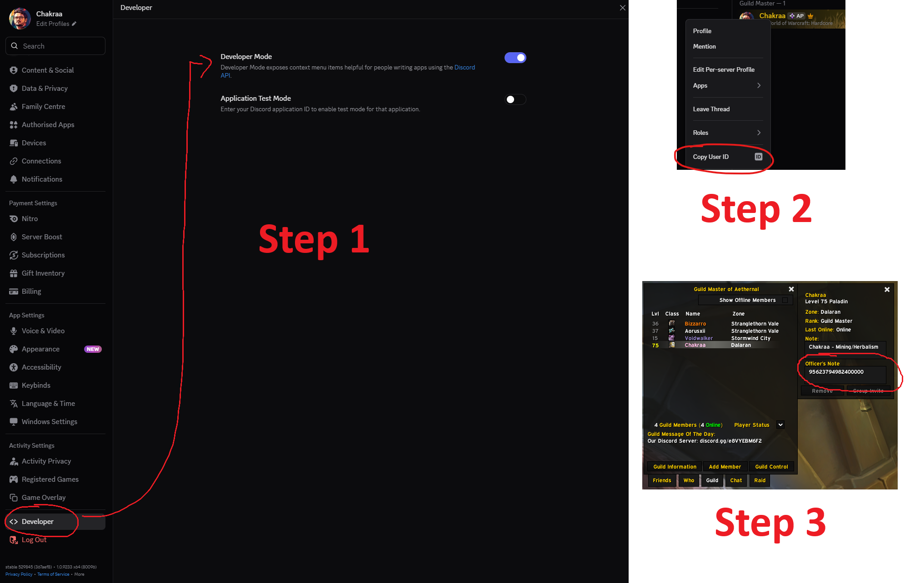
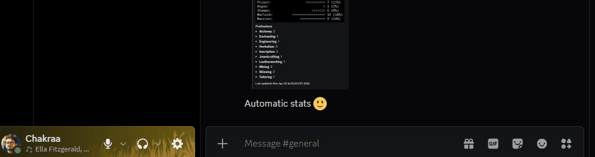

# WoW-Discord-Chat-Bot
Recomp of a bot from [@fjaros](https://github.com/fjaros/wowchat) with added functionalities for use on 3.3.5 WOTLK Private Servers, mainly.

Feel free to follow [their guide](https://github.com/fjaros/wowchat) on how to do the initial bot setup.

If you have any questions, add me on Discord: **Chakraa**

---

### Features
* Guild Online List — auto-updating Discord embed showing online members with level, race, class and zone, including Discord mention if linked
* Guild Roster — auto-updating Discord embed showing all guild members grouped by Discord account with level, race and class per character
* Guild Sync Audit — auto-updating Discord embed showing Discord members without a linked WoW character, grouped by role
* Guild Role Sync — automatically assigns Discord roles based on in-game guild rank via public/officer notes
* Whisper Invite — players whisper the bot a trigger word and automatically receive a guild invite in-game
* DM Auto-Reply — bot replies to anyone who DMs it with a configurable message
* Bot Status Rotation — cycles through custom Discord status messages with {online-members} token
* show_username_in_wow — per-channel option to hide Discord usernames when relaying to WoW
* Watchdog — separate process monitors bot health and restarts it automatically if the WoW connection dies or Discord relay breaks silently
* Guild Death Ping — automatically mentions a configured Discord role when a guild member dies in-game
* and more!

---

### How to Use
* Download the [latest version](https://github.com/ChakraaThePanda/WoW-Discord-Chat-Bot/archive/refs/heads/main.zip).
* Open the ``wowchat.conf`` to configure the bot to your liking
* Run `run.bat` (or `run.sh` on Linux) — this starts the watchdog which manages the bot automatically in case of server restarts
* To run on Windows startup, place a shortcut to `run.bat` in your Windows Startup folder (`shell:startup`)

#### Configuration
All features are documented and optional in `wowchat.conf`. Features are disabled by default — set the relevant channel IDs or enable flags to activate them.

---

## Helpful Guide for the Guild Roster Module
If activated, this module allows you to link your characters in-game to your Discord account through your Discord ID, enabling many features like:
* Showing all your characters under your Discord Tag in the Guild Roster panel
* Showing your ownership next to your characters in the Who's Online panel
* Showing your ownership when using the ``/who`` command
* Enabling the use of ``/profession`` commands for your registered characters
* Etc.

<ins>**Each member of your guild will need to follow these steps if they want to link their characters properly.**</ins>

### How to Link your Discord ID to your Characters
1. Enable Developer Mode in Discord: User Settings → Advanced → Developer Mode
2. Right-click your username anywhere in Discord and click **Copy User ID**
3. Log into WoW, open the Guild panel, find your character, and paste your User ID in either your **Public or Officer Note** (depends on bot config)
4. The bot syncs automatically

### Adding Professions to your Characters
After having successfully linked your characters, you can use the bot's slash commands to add your professions to your characters to show up in ⁠guild-roster.

Using ``/professions list`` will show every character with the selected professions and their skill rank if you are looking for someone to help.

